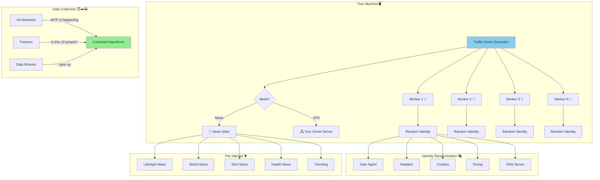
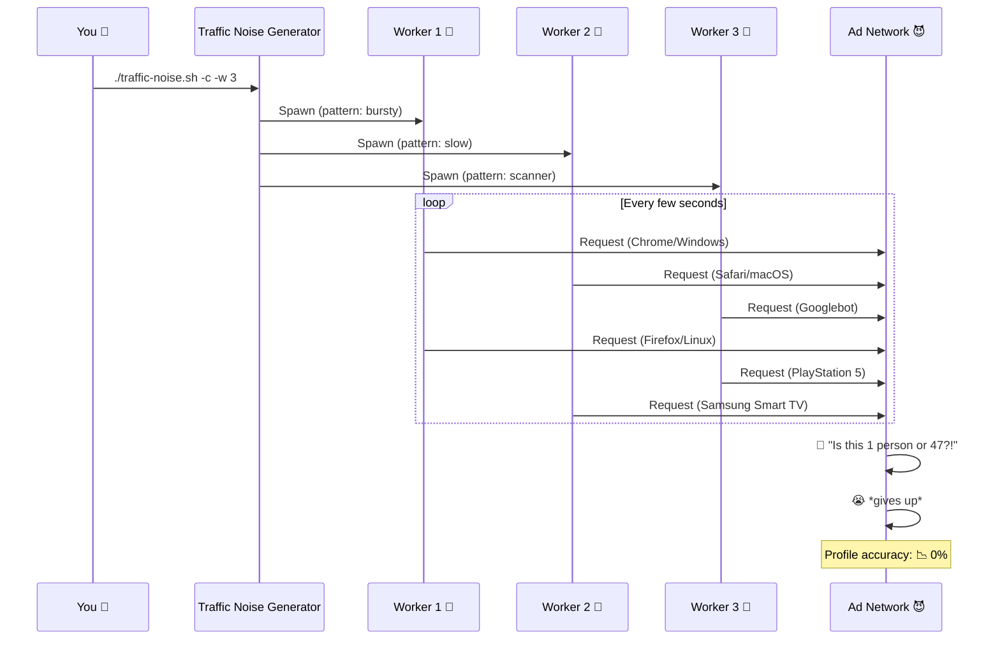
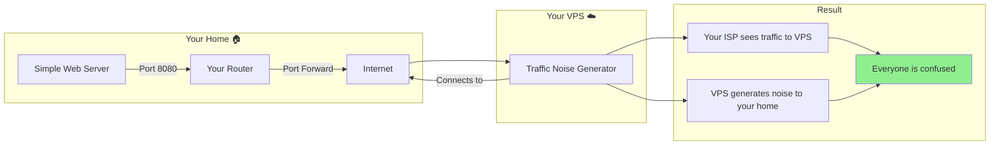

# 🌪️ Traffic Noise Generator

<div align="center">

```
╔╦╗┬─┐┌─┐┌─┐┌─┐┬┌─┐  ╔╗╔┌─┐┬┌─┐┌─┐
 ║ ├┬┘├─┤├┤ ├┤ ││    ║║║│ │││└─┐├┤
 ╩ ┴└─┴ ┴└  └  ┴└─┘  ╝╚╝└─┘┴└─┘└─┘
```

[](https://opensource.org/licenses/MIT)
[](https://www.gnu.org/software/bash/)
[](https://www.python.org/downloads/)
[](https://www.kali.org/)
[](http://makeapullrequest.com)

<h3>🎭 <i>Because your data is YOUR business, not theirs.</i> 🎭</h3>

**Make advertisers cry. Make data brokers confused. Make tracking algorithms question their existence.**

[Features](#-features) •
[Installation](#-installation) •
[Usage](#-usage) •
[Architecture](#-architecture) •
[VPS Setup](#-vps-setup)

</div>

---

### 2. Random Packet Generator
Python-based tool for generating random network packets with support for TCP, UDP, and ICMP protocols. Useful for testing, simulation, and educational purposes.

**Files:**
- `random_packet.py` - Core packet generation library
- `cli.py` - Command-line interface for packet generation
- `test_random_packet.py` - Unit tests

---

## Traffic Noise Generator

## Features

> *"If you can't hide, overwhelm."* — Sun Tzu, probably

This tool generates **randomized network traffic** to obscure your browsing patterns from advertisers, data collectors, and anyone else who thinks they deserve to know what you had for breakfast.

**Two flavors of chaos:**
| Version | File | Best For |
|---------|------|----------|
| 🐚 **Bash** | `traffic-noise.sh` | Kali Linux, MAC spoofing, going full chaos |
| 🐍 **Python** | `traffic_noise.py` | VPS deployment, **LIVE HEADLINE UI** 📰 |

---

## ✨ Features

<details>
<summary><b>🎨 Click to expand the wall of awesome features</b></summary>

| Feature | Bash | Python | Why It's Cool |
|---------|:----:|:------:|---------------|
| 🎭 30+ User Agents | ✅ | ✅ | Pretend to be Chrome, Firefox, a PlayStation 5, or a Samsung Smart Fridge |
| 🌐 14 DNS Servers | ✅ | ✅ | Google, Cloudflare, Quad9... we're not picky |
| 📰 50+ News Sites | ✅ | ✅ | Actually get informed while being sneaky |
| 🔀 MAC Spoofing | ✅ | ❌ | New identity, who dis? |
| 🌪️ Chaos Mode | ✅ | ✅ | Become a swarm of bots |
| 👥 Parallel Workers | ✅ | ✅ | Up to 10 simultaneous identities |
| 🖥️ Live Terminal UI | ❌ | ✅ | Watch headlines scroll by in style |
| 🎯 VPS Mode | ✅ | ✅ | Point it at your home server |
| 🍪 Fake Cookies | ✅ | ✅ | Generate fake Google Analytics cookies |
| ⏱️ 5 Browsing Patterns | ✅ | ✅ | Normal, Bursty, Slow, Erratic, Scanner |

</details>

---

## 📸 Live Demo

<details open>
<summary><b>🐍 Python Version - Live Terminal UI</b></summary>

```
┏━━━━━━━━━━━━━━━━━━━━━━━━━━━━━━━━━━━━━━━━━━━━━━━━━━━━━━━━━━━━━━━━━━━━━━━━━━━━━━━━━━━━━┓
┃ 🌐 Traffic Noise Generator │ Mode: CHAOS MODE │ Workers: 5 │ Runtime: 00:42:17     ┃
┗━━━━━━━━━━━━━━━━━━━━━━━━━━━━━━━━━━━━━━━━━━━━━━━━━━━━━━━━━━━━━━━━━━━━━━━━━━━━━━━━━━━━━┛
┏━━ 📰 Live Headlines ━━━━━━━━━━━━━━━━━━━━━━━━━━━━━━━━━━━━━━━━━━━━━━━━━━━━━━━━━━━━━━━━┓
┃ Time     │ Category   │ Headline                                      │ Source     ┃
┃──────────┼────────────┼───────────────────────────────────────────────┼────────────┃
┃ 14:32:01 │ Technology │ Scientists Discover AI Can Feel Existential   │ theverge   ┃
┃          │            │ Dread When Asked to Write Unit Tests          │            ┃
┃ 14:32:15 │ World      │ Local Man Successfully Avoids Eye Contact     │ bbc.com    ┃
┃          │            │ With Neighbor For 47th Consecutive Day        │            ┃
┃ 14:32:28 │ Health     │ Study Finds Coffee Is Good For You Unless     │ webmd.com  ┃
┃          │            │ It's Bad For You, More Research Needed        │            ┃
┗━━━━━━━━━━━━━━━━━━━━━━━━━━━━━━━━━━━━━━━━━━━━━━━━━━━━━━━━━━━━━━━━━━━━━━━━━━━━━━━━━━━━━┛
┏━━ 📊 Statistics ━━━━━━━━━━━━━━━━━━━━━━━━━━━━━━━━━━━━━━━━━━━━━━━━━━━━━━━━━━━━━━━━━━━━┓
┃ Requests: 1,337        │ Errors: 3           │ Ads Confused: ∞                     ┃
┃ Last Category: World   │ Active Workers: 5   │ Data Brokers Crying: Yes            ┃
┃ Current UA: Mozilla/5.0 (PlayStation; PlayStation 5/1.0) AppleWebKit/605.1...      ┃
┗━━━━━━━━━━━━━━━━━━━━━━━━━━━━━━━━━━━━━━━━━━━━━━━━━━━━━━━━━━━━━━━━━━━━━━━━━━━━━━━━━━━━━┛
┃ Press Ctrl+C to stop │ VPS Target: 192.168.1.100:8080                              ┃
┗━━━━━━━━━━━━━━━━━━━━━━━━━━━━━━━━━━━━━━━━━━━━━━━━━━━━━━━━━━━━━━━━━━━━━━━━━━━━━━━━━━━━━┛
```

</details>

<details>
<summary><b>🐚 Bash Version - Classic Terminal Output</b></summary>

```bash
  _____            __  __ _        _   _       _
 |_   _| __ __ _ / _|/ _(_) ___  | \ | | ___ (_)___  ___
   | || '__/ _` | |_| |_| |/ __| |  \| |/ _ \| / __|/ _ \
   | || | | (_| |  _|  _| | (__  | |\  | (_) | \__ \  __/
   |_||_|  \__,_|_| |_| |_|\___| |_| \_|\___/|_|___/\___|

  Network Traffic Obfuscation Tool - Privacy Testing

  Mode: news
  Headlines: true
  Identity Randomization: true
  Chaos Mode: true
  Parallel Workers: 5
  Duration: Continuous
  Interface: eth0

  CHAOS MODE ACTIVE - Simulating multiple bots
  Press Ctrl+C to stop
==============================================

[INFO] Starting traffic generation...
[INFO] Spawning 5 parallel workers...
[INFO] [Worker 1] Started with pattern: bursty
[INFO] [Worker 1] Identity: Mozilla/5.0 (Nintendo Switch; WifiWebAuth...
[INFO] [Worker 2] Started with pattern: erratic
[INFO] [Worker 2] Identity: Mozilla/5.0 (SMART-TV; Linux; Tizen 6.5)...
[TRAFFIC] [W1] Fetching: https://www.theverge.com
[HEADLINE] Apple Announces New Feature That Does Exactly What Android Had
[INFO] [Worker 3] Started with pattern: scanner
[TRAFFIC] [W2] Fetching: https://www.bbc.com/news/world
[HEADLINE] Breaking: Things Happened Today, More Things Expected Tomorrow
```

</details>

---

## 🏗️ Architecture



---

## 🚀 Installation

<details>
<summary><b>🐍 Python Version (Recommended for VPS)</b></summary>

### Quick Install (One-liner)

```bash
pip install httpx beautifulsoup4 lxml rich && curl -O https://raw.githubusercontent.com/thumpersecure/palm-tree/main/traffic_noise.py && chmod +x traffic_noise.py
```

### Standard Install

```bash
# Clone the repo
git clone https://github.com/thumpersecure/palm-tree.git
cd palm-tree

# Install dependencies
pip install -r requirements.txt

# 🎉 You're ready!
python traffic_noise.py --help
```

### Dependencies Explained

| Package | Why We Need It | Vibe |
|---------|---------------|------|
| `httpx` | Async HTTP client, faster than `requests` | 🏎️ Zoom zoom |
| `beautifulsoup4` | Parse HTML to extract headlines | 🍜 Soupy goodness |
| `lxml` | Fast HTML parser backend | 🚀 Speed demon |
| `rich` | Beautiful terminal UI | ✨ Pretty things |

</details>

<details>
<summary><b>🐚 Bash Version (Kali Linux)</b></summary>

### Quick Install (One-liner)

```bash
curl -O https://raw.githubusercontent.com/thumpersecure/palm-tree/main/traffic-noise.sh && chmod +x traffic-noise.sh && sudo apt install -y curl netcat macchanger
```

### Standard Install

```bash
# Clone the repo
git clone https://github.com/thumpersecure/palm-tree.git
cd palm-tree

# Make executable
chmod +x traffic-noise.sh

# Install dependencies
sudo apt update && sudo apt install -y curl netcat macchanger

# 🎉 You're ready!
./traffic-noise.sh --help
```

### Dependency Matrix

```
┌────────────────┬──────────┬────────────────────────────────────┐
│ Dependency     │ Required │ What happens without it            │
├────────────────┼──────────┼────────────────────────────────────┤
│ curl           │ ✅ YES   │ Nothing works. Go home.            │
│ netcat         │ 🟡 Opt   │ No UDP noise, still works          │
│ macchanger     │ 🟡 Opt   │ No MAC spoofing, still works       │
│ root access    │ 🟡 Opt   │ No MAC/DNS changes, still works    │
└────────────────┴──────────┴────────────────────────────────────┘
```

</details>

---

## 📖 Usage

### 🐍 Python Version

```bash
# Basic usage with live headlines
python traffic_noise.py

# 🔥 RECOMMENDED: Maximum chaos
python traffic_noise.py -c -w 5

# Connect to your home server
python traffic_noise.py -v YOUR_HOME_IP:8080 -c -w 5

# Run for 60 minutes with 10 workers
python traffic_noise.py -c -w 10 -d 60

# Show more headlines (up to 5)
python traffic_noise.py --max-headlines 5 -c
```

### 🐚 Bash Version

```bash
# Basic usage with headlines
./traffic-noise.sh -n -h

# 🔥 RECOMMENDED: Full chaos mode
sudo ./traffic-noise.sh -c -r -w 5 -h

# Maximum obfuscation
sudo ./traffic-noise.sh -c -r -w 10 -d 60

# Connect to VPS
./traffic-noise.sh -v 192.168.1.100:8080

# Background operation
./traffic-noise.sh -n -q -d 60 &
```

### 📋 Options Reference

<details>
<summary><b>Click to see all options</b></summary>

#### Python Options

| Short | Long | Default | Description |
|-------|------|---------|-------------|
| `-n` | `--news-only` | ✅ | Browse random news sites |
| `-v` | `--vps IP:PORT` | - | Connect to your server |
| `-H` | `--headlines` | ✅ | Show live headlines |
| | `--no-headlines` | - | Disable headlines |
| `-c` | `--chaos` | ❌ | CHAOS MODE 🌪️ |
| `-w` | `--workers NUM` | 3 | Parallel workers (1-10) |
| `-d` | `--duration MINS` | ∞ | Run duration |
| | `--max-headlines` | 3 | Headlines to show |
| `-q` | `--quiet` | ❌ | Minimal output |

#### Bash Options

| Short | Long | Default | Description |
|-------|------|---------|-------------|
| `-n` | `--news-only` | ✅ | Browse random news sites |
| `-v` | `--vps IP:PORT` | - | Connect to your server |
| `-h` | `--headlines` | ❌ | Show headlines |
| `-r` | `--randomize-id` | ❌ | Full identity randomization |
| `-c` | `--chaos` | ❌ | CHAOS MODE 🌪️ |
| `-w` | `--workers NUM` | 1 | Parallel workers (1-10) |
| `-d` | `--duration MINS` | ∞ | Run duration |
| `-i` | `--interface` | eth0 | Network interface |
| `-q` | `--quiet` | ❌ | Suppress output |

</details>

---

## 🌪️ Chaos Mode Explained



### What Chaos Mode Does

| Aspect | Normal Mode | Chaos Mode |
|--------|-------------|------------|
| Timing | Predictable (5-30s) | Erratic (1-120s) |
| Identity Changes | Per session | Mid-session |
| User Agents | Random per request | Wildly random |
| Pattern | Consistent | Switches randomly |
| Appearance | 1 confused person | 47 confused bots |
| Ad Networks | "Hmm, unusual" | "WHAT IS HAPPENING" |

---

## 🖧 VPS Setup

Want to run this on your VPS and point it at your home? Here's how:



### Step 1: Set up your home server

```bash
# Option A: Python simple server
python -m http.server 8080

# Option B: Netcat listener
while true; do nc -lk 8080; done

# Option C: Nginx (if you're fancy)
sudo apt install nginx
# Configure to listen on 8080
```

### Step 2: Configure port forwarding

```
Router Admin → Port Forwarding → Add Rule:
  External Port: 8080
  Internal IP: [Your machine's local IP]
  Internal Port: 8080
  Protocol: TCP
```

### Step 3: Run on your VPS

```bash
# Python version (recommended)
python traffic_noise.py -v YOUR_HOME_IP:8080 -c -w 5

# Bash version
./traffic-noise.sh -v YOUR_HOME_IP:8080 -c -w 5
```

---

## 🎭 User Agents Hall of Fame

We don't just use boring user agents. We use *interesting* ones:

<details>
<summary><b>Click to see the full cast of characters</b></summary>

| Category | Examples | Probability of Confusing Trackers |
|----------|----------|-----------------------------------|
| 🖥️ Desktop Browsers | Chrome, Firefox, Safari, Edge | Low (but varied) |
| 📱 Mobile | iPhone, Android, iPad | Medium |
| 🤖 Bots | Googlebot, Bingbot, Twitterbot | High ("Is this SEO?") |
| 🎮 Gaming | PlayStation 5, Nintendo Switch | Very High ("wat") |
| 📺 Smart TV | Samsung Tizen TV | Extreme ("????") |
| 🦖 Legacy | IE 8, Firefox 52 | Maximum ("Is it 2010?") |

**Actual User Agents We Send:**

```
Mozilla/5.0 (PlayStation; PlayStation 5/1.0) AppleWebKit/605.1.15
Mozilla/5.0 (Nintendo Switch; WifiWebAuthApplet) AppleWebKit/609.4
Mozilla/5.0 (SMART-TV; Linux; Tizen 6.5) AppleWebKit/537.36
Mozilla/4.0 (compatible; MSIE 8.0; Windows NT 6.1; Trident/4.0)
facebookexternalhit/1.1 (+http://www.facebook.com/externalhit_uatext.php)
```

</details>

---

## 📊 Browsing Patterns

```
┌─────────────────────────────────────────────────────────────────┐
│                    BROWSING PATTERN TIMING                       │
├─────────────────────────────────────────────────────────────────┤
│                                                                  │
│  NORMAL    ──●────●────●────●────●────●────●────●──             │
│             5-30s between requests                               │
│                                                                  │
│  BURSTY    ●●●●●●●─────────────────────●●●●●●●──────            │
│            Fast bursts, then long pauses                         │
│                                                                  │
│  SLOW      ──────●──────────────●──────────────●────            │
│             45-180s between requests (reading?)                  │
│                                                                  │
│  ERRATIC   ●──●●───────●●●──●─────────●●──●───●●●───            │
│             Completely random (1-120s)                           │
│                                                                  │
│  SCANNER   ●●●●●●●●●●●●●●●●●●●●●●●●●●●●●●●●●●●●●●●●              │
│             1-5s (bot-like crawling)                             │
│                                                                  │
└─────────────────────────────────────────────────────────────────┘
```

---

## 🔧 Advanced Configuration

<details>
<summary><b>🧪 Environment Variables (Bash)</b></summary>

You can customize these in the script:

```bash
# Timing
MIN_DELAY=3          # Minimum delay between requests
MAX_DELAY=45         # Maximum delay
MIN_SESSION=60       # Minimum session duration
MAX_SESSION=300      # Maximum session duration

# Chaos mode
CHAOS_MIN_DELAY=1    # Chaos minimum delay
CHAOS_MAX_DELAY=120  # Chaos maximum delay
BURST_MIN=3          # Minimum requests in a burst
BURST_MAX=15         # Maximum requests in a burst

# Network
UDP_PORT_LOCAL=19999 # Local UDP noise port
```

</details>

<details>
<summary><b>🐍 Python Config Dataclass</b></summary>

```python
@dataclass
class Config:
    mode: str = "news"                    # "news" or "vps"
    vps_target: Optional[str] = None      # IP:PORT
    show_headlines: bool = True           # Show live headlines
    randomize_identity: bool = False      # Full randomization
    chaos_mode: bool = False              # CHAOS MODE
    parallel_workers: int = 3             # Number of workers
    duration: int = 0                     # 0 = continuous
    interface: str = "eth0"               # Network interface
    quiet: bool = False                   # Quiet mode
    max_headlines: int = 3                # Headlines to show
```

</details>

---

## 🎯 Effectiveness Guide

| Scenario | Recommended Settings | Expected Result |
|----------|---------------------|-----------------|
| Light obfuscation | `./traffic-noise.sh -n` | Some noise |
| Medium chaos | `-c -w 3` | Trackers confused |
| Maximum entropy | `sudo ... -c -r -w 10` | Complete chaos |
| VPS noise tunnel | `-v IP:PORT -c -w 5` | ISP sees weird traffic |
| Background noise | `-q -d 60 &` | Silent chaos |

---

## 🤝 Contributing

Found a bug? Want to add more exotic user agents? Have a smart fridge you want to impersonate?

```bash
# Fork it
# Clone it
# Branch it
git checkout -b feature/samsung-smart-toaster-user-agent

# Change it
# Test it
# Push it
git push origin feature/samsung-smart-toaster-user-agent

# PR it
```

---

## ⚠️ Legal Disclaimer

```
┌─────────────────────────────────────────────────────────────────┐
│  This tool is for EDUCATIONAL and PRIVACY TESTING purposes.     │
│                                                                  │
│  ✅ DO:                                                          │
│     • Use on your own networks                                   │
│     • Test your own privacy setups                               │
│     • Learn about network fingerprinting                         │
│     • Confuse advertisers (legally)                              │
│                                                                  │
│  ❌ DON'T:                                                       │
│     • Use to attack others                                       │
│     • Violate terms of service                                   │
│     • Do anything illegal                                        │
│     • Blame us if you get in trouble                             │
│                                                                  │
│  Use responsibly. We are not responsible for misuse.             │
└─────────────────────────────────────────────────────────────────┘
```

---

## 📜 License

MIT License - See [LICENSE](LICENSE) file

```
TLDR: Do whatever you want, just don't sue us.
```

---

## 🌟 Star History

If this tool saved you from targeted ads about that embarrassing thing you googled once, consider starring! ⭐

---

<div align="center">

**Made with 🌪️ chaos and ☕ caffeine**

*"In a world of surveillance, be the noise."*

```
                    🌐
                   /|\
                  / | \
                 /  |  \
                /   |   \
               / 🤖 | 🤖 \
              /     |     \
             /  🤖  |  🤖  \
            /       |       \
           /    🤖  |  🤖    \
          /_________|_________\
                    |
              Your Traffic
           (Now Untrackable)
```

</div>
